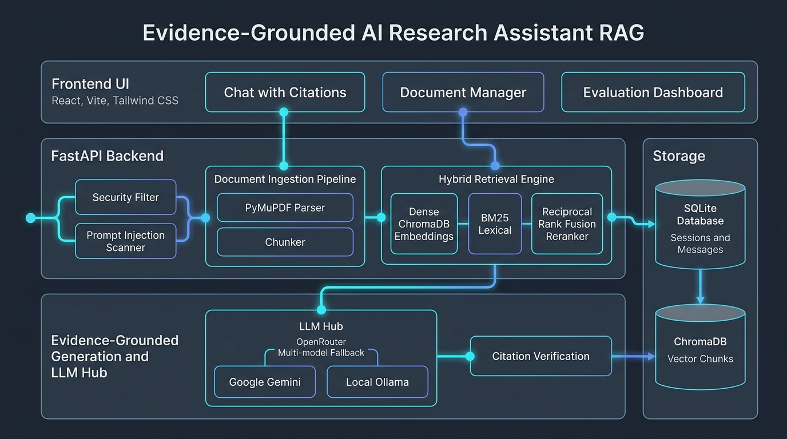
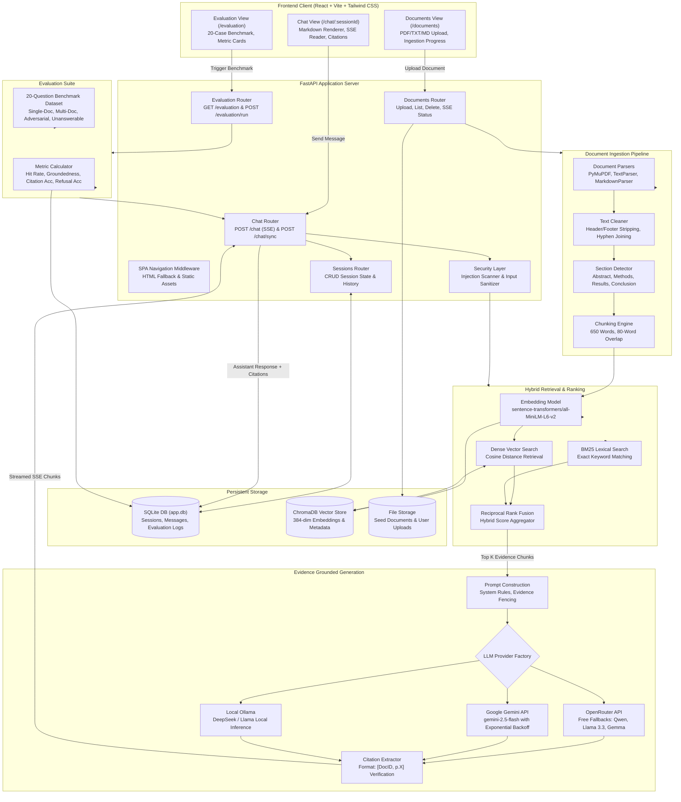

# Architecture diagram

This document outlines the system architecture of the Evidence-Grounded AI Research Assistant.
You can copy the Mermaid code block below and paste it directly into [Excalidraw](https://excalidraw.com) via **More Tools -> Mermaid to Excalidraw** or render it in any Markdown viewer.

## System architecture

## Data flow summary

1. **Ingestion**: Uploaded documents are parsed via PyMuPDF or plain text readers, cleaned, tagged with section headings, chunked into 650-word windows with 80-word overlap, embedded with `all-MiniLM-L6-v2`, and indexed into ChromaDB.
2. **Retrieval**: User queries pass through security screening. A hybrid search combines dense cosine similarity from ChromaDB with BM25 lexical search using Reciprocal Rank Fusion to retrieve the top evidence chunks.
3. **Generation**: Top evidence chunks are fenced in `<retrieved_evidence>` tags with a strict system prompt. The selected LLM (OpenRouter, Gemini, or Ollama) generates answers that separate evidence from inference and reference explicit citations (`[doc_id, p.X]`). Unsupported questions trigger an explicit refusal.
4. **Delivery & Storage**: Responses stream to the React UI via Server-Sent Events (SSE). The user message and assistant answer are saved to SQLite. If the session has a default title, the first user message updates the session title.
